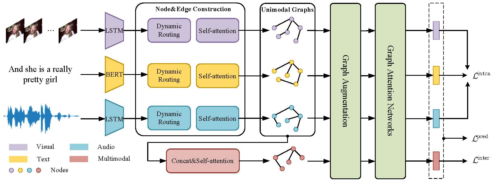

# Introduction

Code for the paper: Capturing High-level Semantic Correlations via Graph for Multimodal Sentiment Analysis




## Dependencies

* PyTorch 1.8.0+cu111
* transformers 4.18.0

You can install the required packages with the following command
```python
pip install -r requirements.txt
```


## Getting Start

First, clone this repo via:

```bash
git clone https://github.com/qianfan1996/HGCC.git
cd HGCC
```

Next, creating some necessary folds via:
```bash
mkdir data saved_results
cd saved_results && mkdir mosi mosei 
cd ..
```

## Data

We evaluate our model on two benchmark datasets CMU-MOSI and CMU-MOSEI.

The data for experiment are placed in `./data/`, you can download the datasets from [this website](https://github.com/thuiar/Self-MM)
and place them to `./data/`.

## Train & Test
Take CMU-MOSI as an example, you can train and test the model at once via:

```bash
./main.sh
```

## Acknowledgement
We acknowledge [this great repository](https://github.com/lzjjeff/HGraph-CL) for reference.
